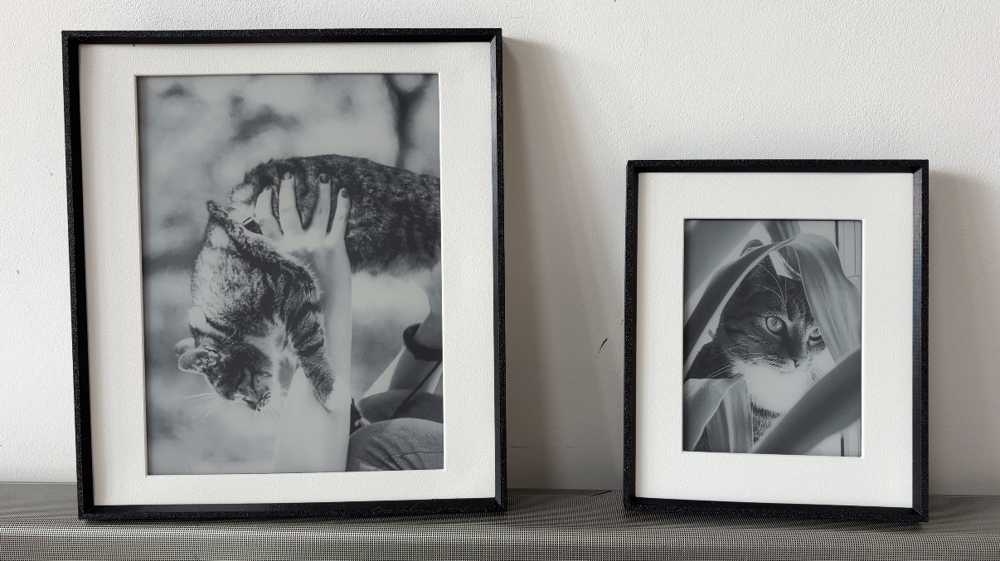
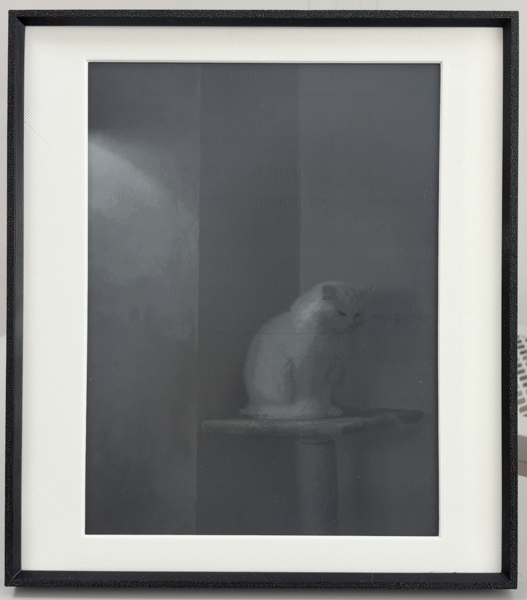
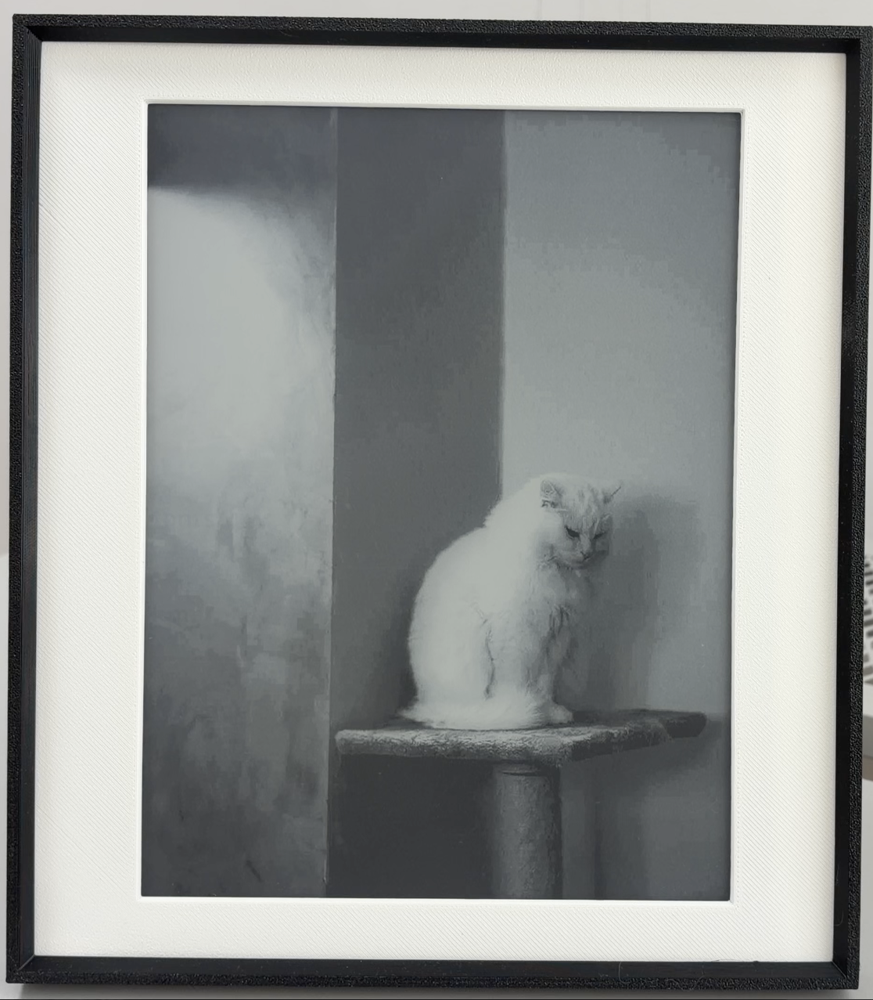
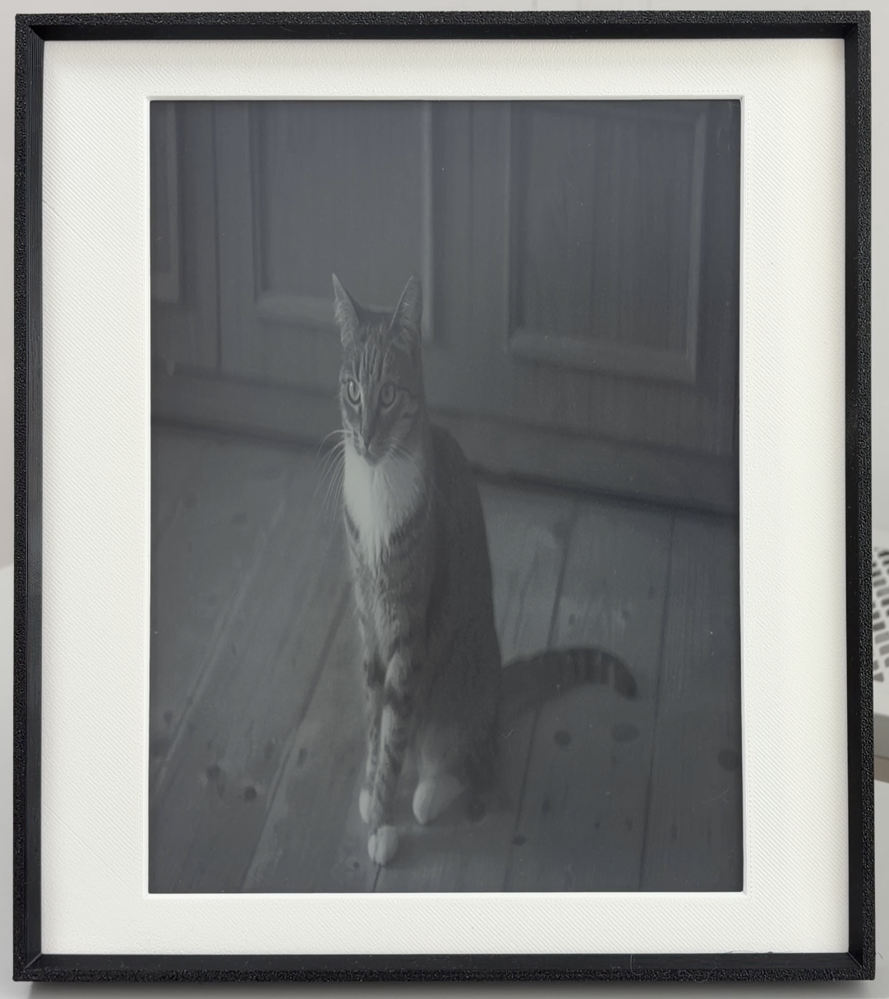
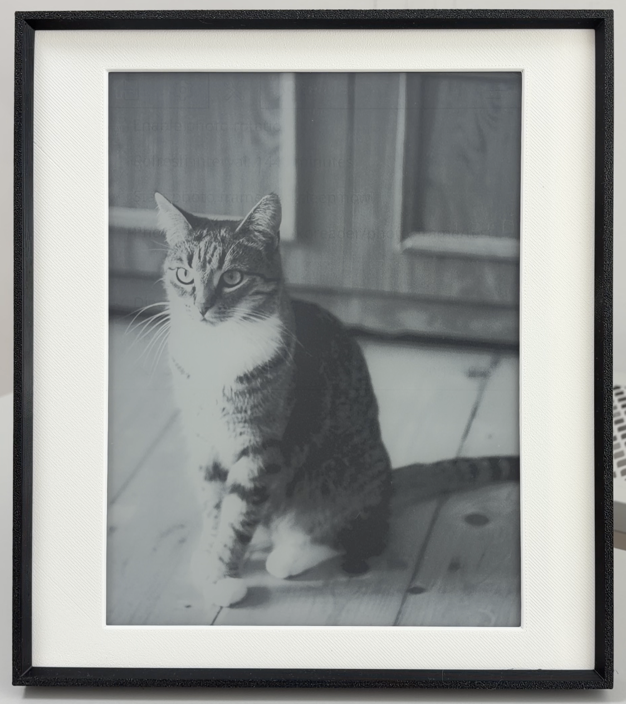
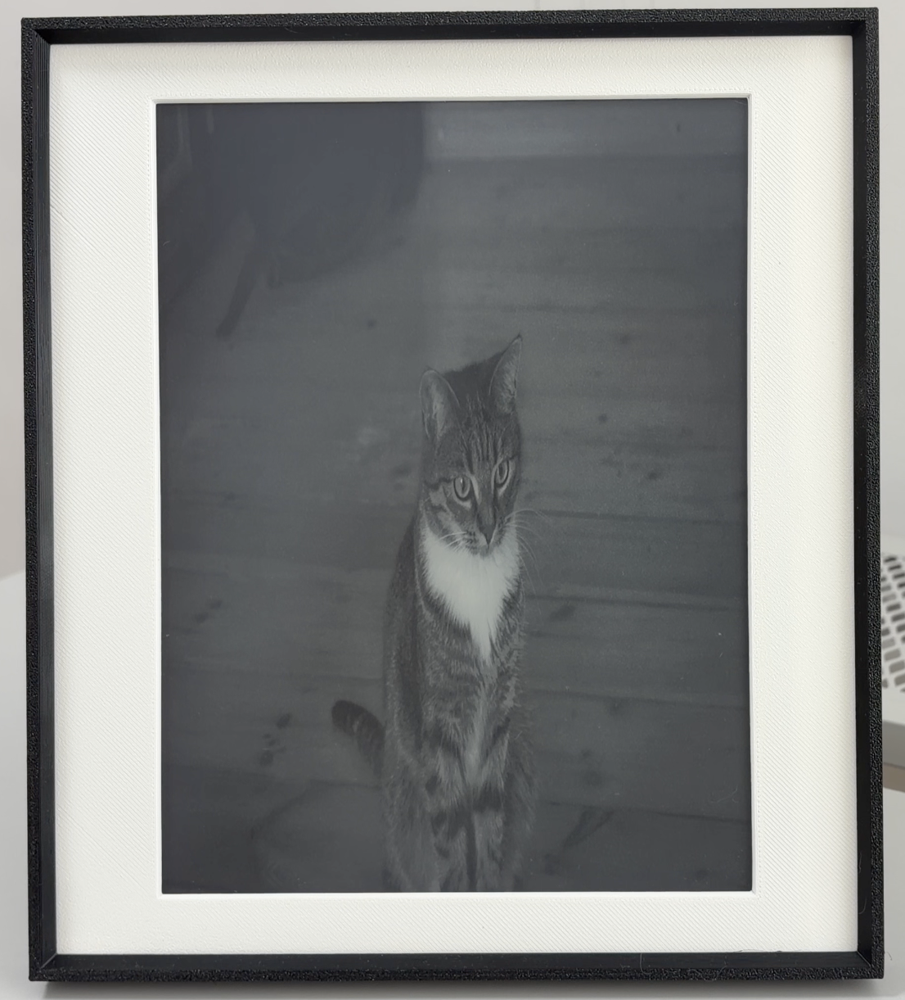
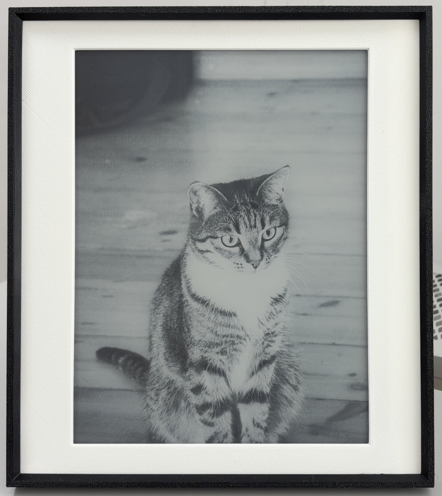

# Kindle Photo Frame

Turn a jailbroken Kindle running KOReader into an offline, low-power digital photo frame.
Photos stay on the Kindle; the plugin does not use Wi-Fi.



## Will it work on my Kindle?

Personally tested successfully on **Kindle Paperwhite 3** and **Kindle Scribe (1st generation)**.
The plugin uses KOReader’s standard Kindle APIs, so other KOReader-supported Kindles are
expected to work too, but they have not been tested here. On an untested Kindle, start with
the existing **2-minute** interval and confirm several photo changes before relying on it.

## What you need

- A jailbroken Kindle with KOReader installed. If needed, use the
  [Kindle Modding Jailbreak Wizard](https://kindlemodding.org/jailbreak-wizard.html),
  then follow [Getting KOReader](https://kindlemodding.org/jailbreaking/whats-next/getting-koreader/).
- A USB cable.

### Optional

- Windows x64 or an Apple Silicon Mac for the optional Photo Prep app.
  Linux users can use the [developer workflow](docs/development.md).

## Download

From [GitHub Releases](https://github.com/kuslota/kindle-photo-frame/releases), download:

- `Kindle-Photo-Frame-Plugin.zip` - everyone needs this.
- The Photo Prep package for your computer, if you want to prepare photos:
  Windows x64 or macOS Apple Silicon.

## Install the plugin

1. Extract the plugin ZIP.
2. Connect the Kindle by USB and open its drive.
3. Copy the folder `photo_frame.koplugin` into `koreader/plugins/`.

```text
Kindle drive/koreader/plugins/photo_frame.koplugin
```

## Add photos

The fastest way to try Photo Frame is to copy supported images directly to:

```text
Kindle drive/koreader/photo_frame/images/
```

Photo Frame scans JPG/JPEG, PNG, BMP, GIF, TIFF, and WEBP files, including subfolders.

Photo preparation is **optional**, not a plugin prerequisite. Kindle Photo Prep is
recommended because it crops/resizes photos for your Kindle and adjusts them for e-ink,
which usually gives more predictable results. This is especially helpful for landscape photos.
Unprepared photos may have less predictable cropping, scaling, contrast, or e-ink appearance,
but they may still work well.

### Why prepare photos?

Use the same source photo on the same Kindle under comparable conditions:

| Original / unprepared on Kindle | Same photo after Kindle Photo Prep |
| --- | --- |
|  |  |
|  |  |
|  |  |

**Recommended flow:** extract and launch the Photo Prep package, choose your Kindle, prepare
the photos, then copy the exported JPG/PNG files to `koreader/photo_frame/images/`. Choose a known model preset;
**Other Kindle / Custom resolution** is available when you know the screen dimensions.

Photo Prep accepts the supported photo formats above plus HEIC/HEIF and AVIF as
computer-side input files.

Photos do not have to exactly match the Kindle’s screen resolution, KOReader can scale them.
Preparing at the native resolution simply makes cropping and quality more predictable.

## Start Photo Frame

1. Restart KOReader so it loads the plugin.
2. Open **Tools → Photo frame → Change photo every** and set **2 minutes** for a test.
3. Choose **Tools → Photo frame → Start photo frame and sleep now**.
4. Leave the Kindle asleep and confirm several photo changes (it **may** take a bit more than exactly 2 minutes for the change to happen).
5. Wake it normally, then change the interval to **15 minutes** or longer. Airplane mode is
   recommended for the intended offline, low-power use.

To stop it, wake the Kindle and uncheck **Tools → Photo frame → Automatically change photos**.

## Optional 3D-printed frame

[Frame files](3d_frame_files/) are included for Kindle Paperwhite 3 and Scribe (1st generation),
with printable STLs and parametric Fusion 360 models you can adapt to other sizes.
The frame is optional and lets you remove the Kindle when you want to read.

**Suggested print settings:** 0.4 mm nozzle, 0.28 mm layer height. Supports are recommended for the inner part.

## If something goes wrong

- **Photo Frame is missing:** check that `main.lua` is directly at
  `koreader/plugins/photo_frame.koplugin/main.lua`, then restart KOReader.
- **No photos appear:** check `koreader/photo_frame/images` and copy individual JPG/PNG
  exports or supported original images, rather than a ZIP or HEIC file.
- **Photos do not rotate:** repeat the 2-minute test with several photos and leave the
  Kindle asleep. Check the [technical compatibility notes](photo_frame.koplugin/README.md#compatibility-boundary).
- **Photos look unexpected:** use Kindle Photo Prep and start with **Medium (recommended)**.
- **You cannot reach KOReader:** remove `koreader/plugins/photo_frame.koplugin` over USB
  and restart KOReader. The plugin does not modify Kindle system files or networking.
- **Windows or macOS shows a security warning:** see Microsoft’s
  [SmartScreen guidance](https://learn.microsoft.com/en-us/windows/apps/package-and-deploy/smartscreen-reputation)
  or Apple’s [opening instructions](https://support.apple.com/en-ie/102445). Do not disable
  security protections.

## More information

- [Development, CLI use, testing, and release builds](docs/development.md)
- [Advanced preprocessing controls and device resolutions](docs/preprocessing.md)
- [Plugin architecture, logs, and compatibility](photo_frame.koplugin/README.md)
- [Design and Kindle bench tests](notes/design.md)
- [First release and publication guide](docs/releasing.md)
- [Contributing](CONTRIBUTING.md)

## License

The project code is available under the [MIT License](LICENSE).
Documentation photographs are not covered by this code license.
